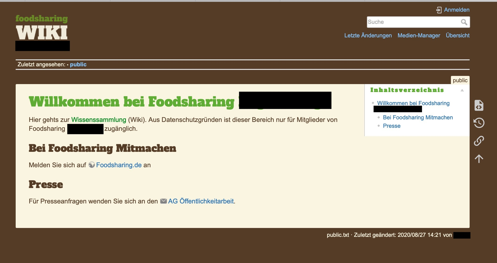

# foosharing-dokuwiki-design
Minimale CSS Anpassungen um Dokuwiki nach Foodsharing aussehen zu lassen.

Diese können einfach die `meta.html` in das `conf`-Verzeichnis stecken.

Alternativ kann auch eine Wiki-Seite angelegt werden, die die Styleanpassungen enthält. Auf diese Wiki-Seite kann mit einem symlink verwiesen werden. Somit kann der Stil über das Frontend bearbeitet werden.

Dokuwiki verfügt über ein super Rechtesystem. Damit kann sowohl das Bloße Betrachten als auch das Bearbeiten von Bereichen auf bestimmte Arbeitsgruppen beschränkt werden.

